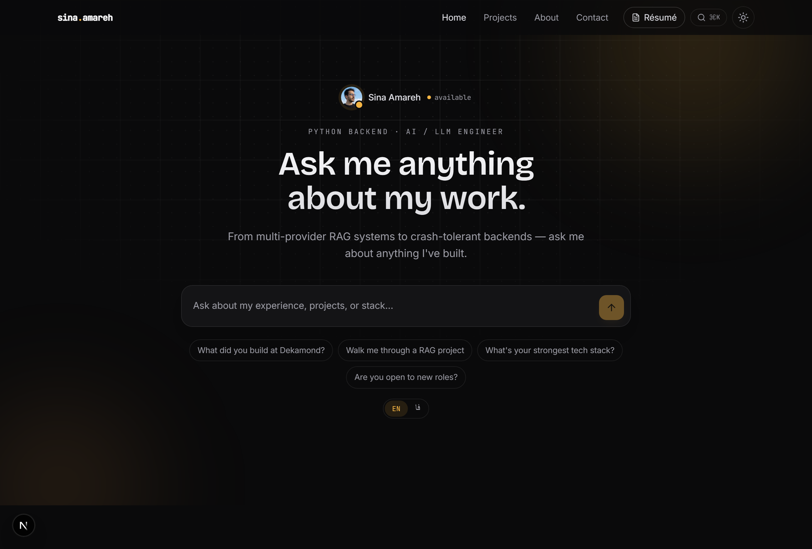
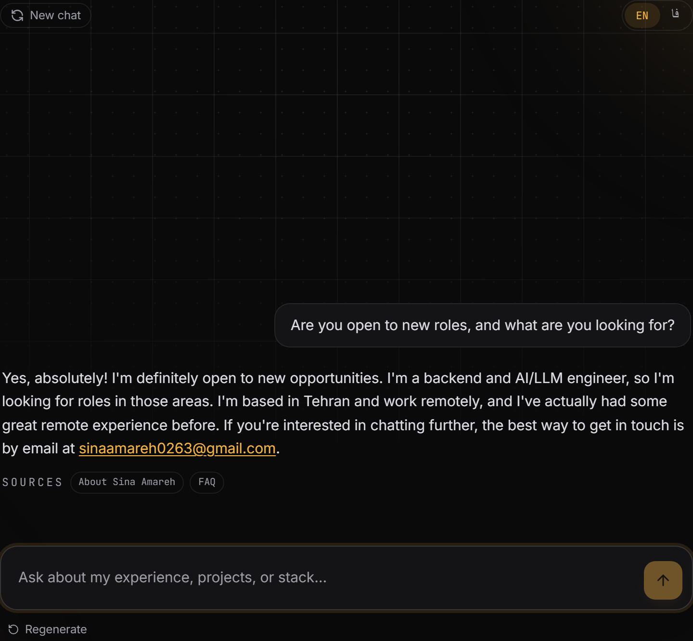

<div align="center">

# Sina Amareh — AI Portfolio

**A premium, bilingual developer portfolio whose centerpiece is a _real_ RAG chatbot — not a mockup.**

Ask it anything about my work and it answers in my own first-person voice, grounded in my actual CV
and projects, streamed token-by-token. It runs on the same multi-provider failover pattern I build
into production systems — so the site itself is a live demo of the craft it describes.

[](https://nextjs.org)
[](https://react.dev)
[](https://www.typescriptlang.org)
[](https://tailwindcss.com)
[](https://sdk.vercel.ai)

**Live:** _coming soon on `*.vercel.app`_

</div>

<p align="center">
  
</p>

---

## Why this is different

Most portfolios _describe_ what someone can do. This one **proves it on the homepage**: the hero
isn't a tagline, it's a working retrieval-augmented chatbot. Visitors type a real question and get a
grounded, human answer with citation chips back to the source. Out-of-scope questions are refused
cleanly with **no LLM call**, so it never makes things up.

## Highlights

- **Chatbot-as-hero** — a real RAG chatbot is the homepage centerpiece. Answers stream in my own
  first-person voice (~1.2s to first token) with source-citation chips.
- **Structurally anti-hallucination** — three guards: a retrieval **threshold gate** (refuses
  off-topic questions with no LLM call), a **strict grounded prompt**, and a **jailbreak pre-filter**.
- **Multi-provider failover** — Gemini 2.5 Flash-Lite → Flash → OpenRouter free models. If one
  provider errors, times out, or hits quota, the next takes over automatically and invisibly.
- **Bilingual + RTL** — viewer-selectable English / فارسی (Vazirmatn font, right-to-left layout,
  warm colloquial Persian — not stiff machine translation).
- **Dark + light** — a refined "Warm Slate + Amber" palette with a toggle, a subtle ambient
  background, and motion that respects `prefers-reduced-motion`.
- **Polished details** — ⌘K command palette, cursor-spotlight cards, scroll-aware nav, an
  auto-scrolling transcript, and a contact CTA.
- **Tested** — 49 unit/component/route tests, 9 Playwright E2E specs (LLM mocked), and a 35-item RAG
  retrieval gate (100% refusal on out-of-scope).

---

## How the RAG chatbot works

```text
Browser ── React UI (useChat) ──▶ /api/chat  (Node serverless route)
                                     1. validate + rate-limit the input
                                     2. embed the question (Gemini, 768-dim)
                                     3. cosine vs kb.json (in-memory, <1ms)
                                     4. THRESHOLD GATE ─ below 0.62? ▶ instant refusal, NO LLM call
                                     5. build a grounded prompt from the top-k chunks
                                     6. streamText() with the provider failover ladder
                                  SSE token stream ──▶ smooth render + source chips

content/*.md ──(npm run embed)──▶ lib/kb.json   (committed; deploys never re-embed)
```

<p align="center">
  <br>
  <em>A grounded answer — first-person voice, citation chips, no hallucination.</em>
</p>

The failover ladder (in [`lib/rag/providers.ts`](lib/rag/providers.ts)) tries providers in order and
only includes ones whose API key is present: **Gemini 2.5 Flash-Lite → Gemini 2.5 Flash → OpenRouter
Qwen3-Next-80B → OpenRouter Llama-3.3-70B**. Your API keys are **server-side only** and never reach
the browser — the client only ever calls our own `/api/chat`.

---

## Tech stack

| Layer | Choice |
| --- | --- |
| Framework | **Next.js 16** (App Router, RSC, React Compiler, Turbopack) |
| Language | **TypeScript** · **React 19** |
| Styling | **Tailwind CSS v4** (CSS-first `@theme`) · **Motion** |
| Chat / streaming | **Vercel AI SDK v6** (`ai`, `@ai-sdk/react`, `@ai-sdk/google`, `@openrouter/ai-sdk-provider`) |
| LLM providers | **Google Gemini** (chat + embeddings) · **OpenRouter** (free-model fallback) |
| Retrieval | **In-memory cosine** over a committed `kb.json` — no vector DB |
| Testing | **Vitest** · **Testing Library** · **Playwright** · custom RAG eval |
| Hosting | **Vercel** (Hobby / free tier) |

---

## 🚀 Run it yourself

### Prerequisites

- **[Node.js 20+](https://nodejs.org)** (check with `node -v`) and npm.
- **Two free API keys** (no credit card):
  - **Google AI Studio** — chat + embeddings → <https://aistudio.google.com/app/apikey>
  - **OpenRouter** — free-model fallback → <https://openrouter.ai/keys>

### 1 · Clone & install

```bash
git clone https://github.com/Sina-Amare/ai-portfolio.git
cd ai-portfolio
npm install
```

### 2 · Add your API keys

```bash
cp .env.example .env.local        # macOS / Linux
# Copy-Item .env.example .env.local   # Windows (PowerShell)
```

Then open `.env.local` and paste your keys:

```ini
GOOGLE_GENERATIVE_AI_API_KEY=your-google-ai-studio-key
OPENROUTER_API_KEY=your-openrouter-key
```

> `.env.local` is gitignored — secrets never get committed.

### 3 · Start the dev server

```bash
npm run dev
```

Open **<http://localhost:3000>** and ask the chatbot anything. 🎉

### Common scripts

| Command | What it does |
| --- | --- |
| `npm run dev` | Dev server with hot reload |
| `npm run build` / `npm start` | Production build / serve it |
| `npm test` | Unit + component + route tests (Vitest) |
| `npm run test:e2e` | Playwright E2E (LLM mocked — no keys needed) |
| `npm run eval` | RAG retrieval gate (needs the Google key) |
| `npm run embed` | Rebuild `lib/kb.json` from `content/` after editing the knowledge base |
| `npm run typecheck` / `npm run lint` | TypeScript / ESLint |

---

## Editing the knowledge base

The chatbot answers from markdown in [`content/`](content/) — CV, FAQ, and one file per project.
After editing, re-embed:

```bash
npm run embed   # re-chunks + re-embeds → lib/kb.json (commit the result)
```

`kb.json` is committed, so deploys never re-embed. **Anything in it is publicly answerable once
deployed** — review before committing.

---

## Project structure

```text
app/
  api/chat/route.ts        # RAG + provider failover + streaming
  page.tsx                 # home: chat hero + featured + about + contact
  projects/                # index + [slug] case studies
components/
  home/chat-hero.tsx       # the centerpiece chatbot
  chat/                    # transcript, input, message, suggestions, lang toggle
  ...                      # nav, footer, command palette, theme, motion, ui/
content/                   # the knowledge base (markdown → kb.json)
lib/rag/                   # chunker, cosine, retrieve, threshold, prompt, providers
scripts/embed.ts           # content/*.md → lib/kb.json
tests/                     # unit · component · e2e
```

---

## Deploy (Vercel, free)

1. Push to GitHub and import at **[vercel.com/new](https://vercel.com/new)** (auto-detected as Next.js).
2. Add the environment variables under **Project → Settings → Environment Variables**.
3. Deploy. The chatbot works immediately — `kb.json` ships with the build, so there's no embedding
   step at deploy time.

---

<div align="center">

Built by **[Sina Amareh](https://github.com/Sina-Amare)** · Python backend + AI/LLM engineer
· [LinkedIn](https://www.linkedin.com/in/sina-amareh-909987286)

_The chatbot you're talking to runs on my own code._

</div>
