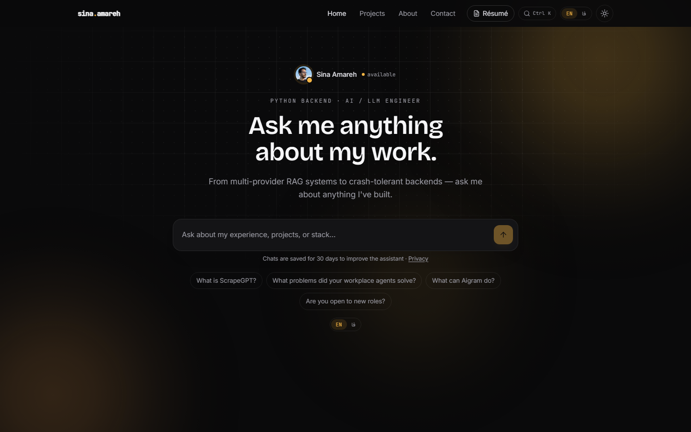
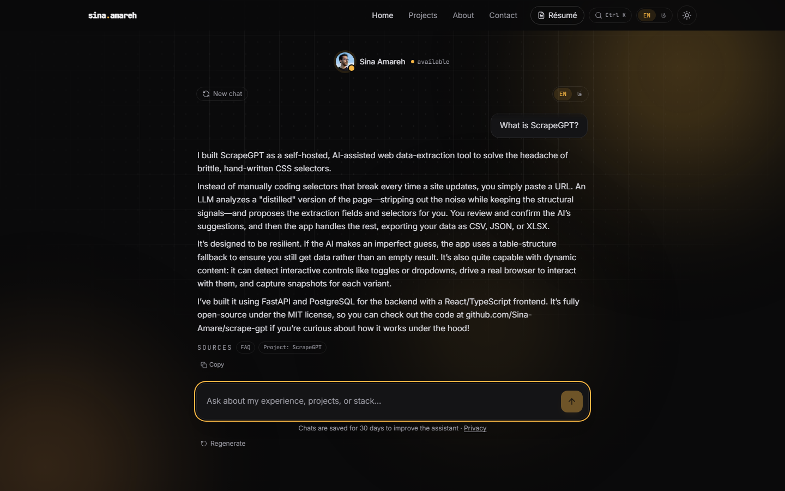
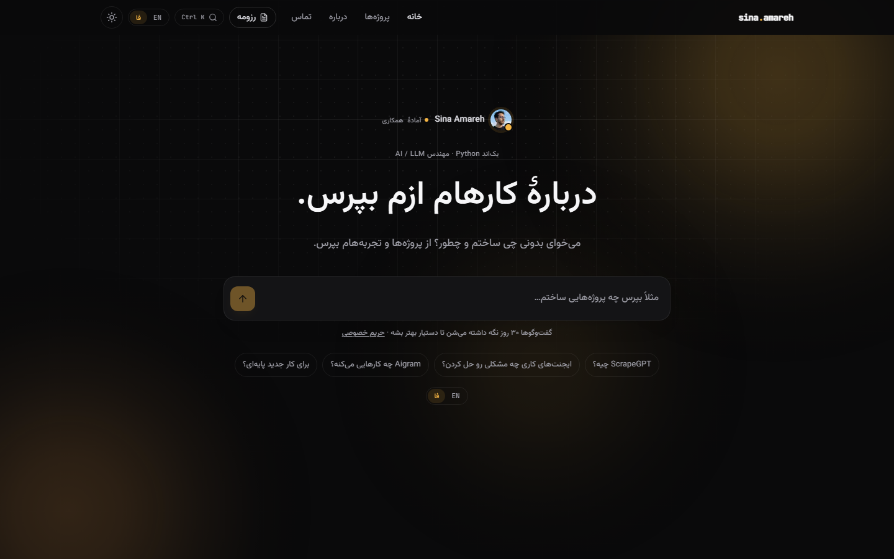
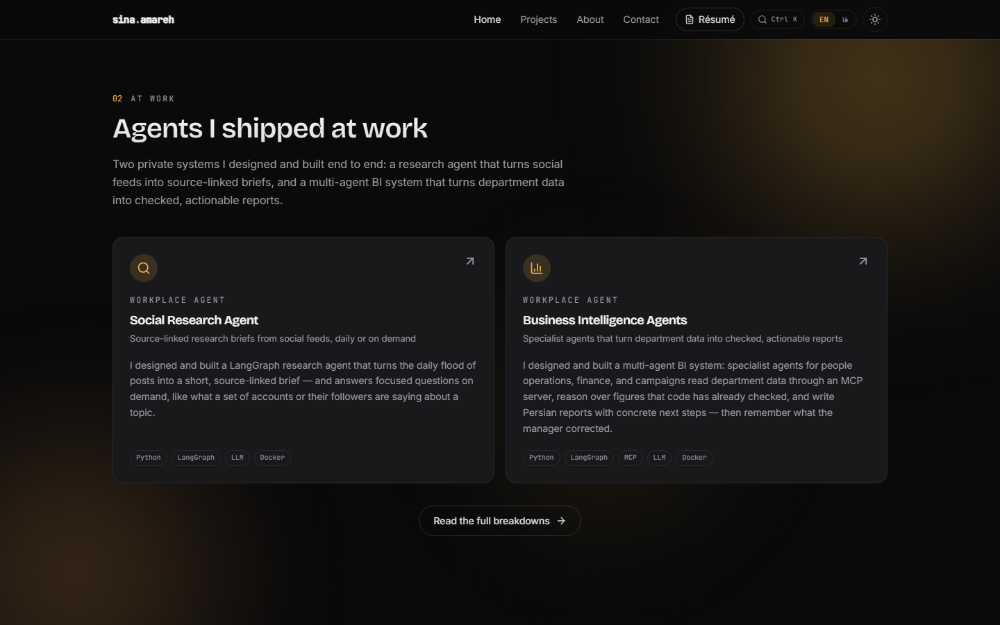
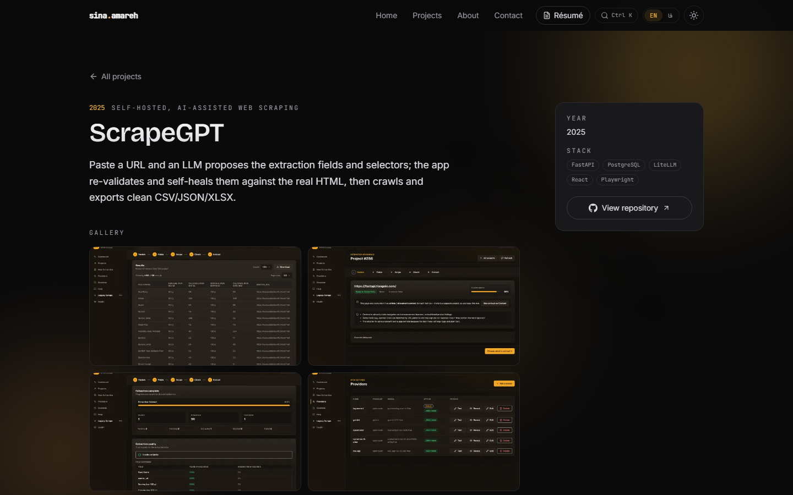
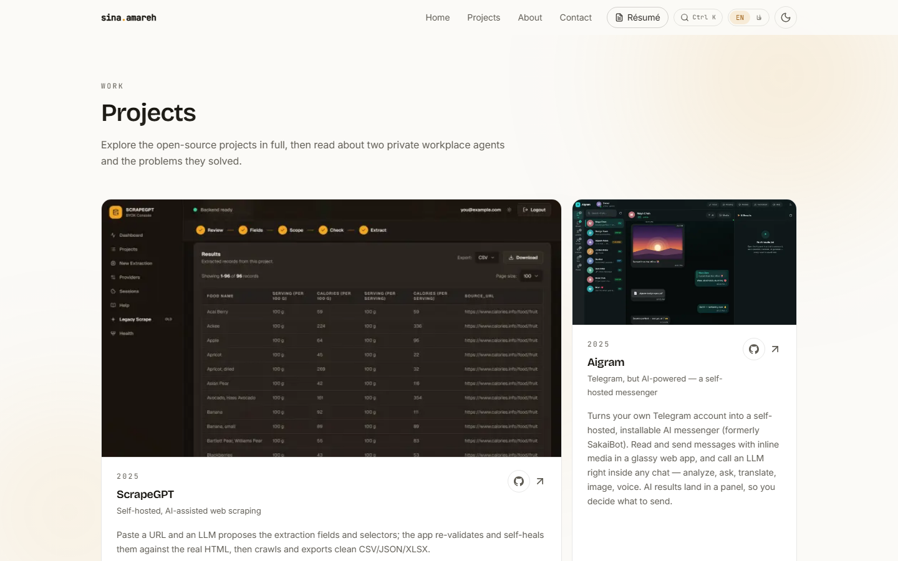
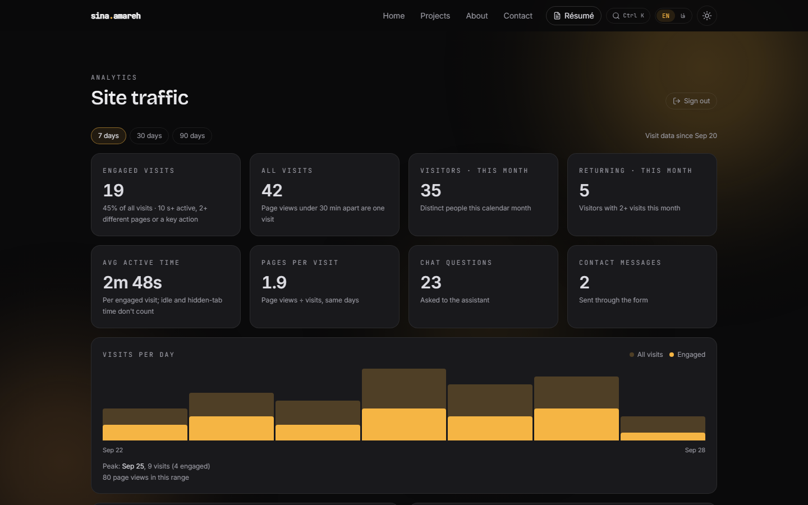
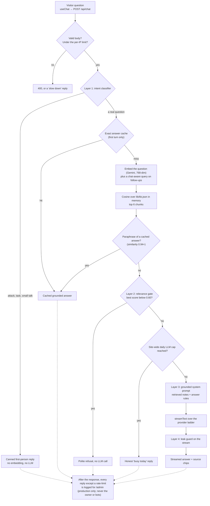
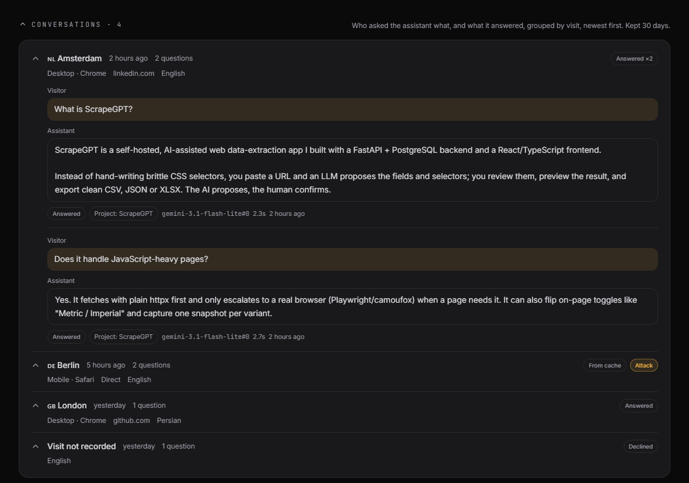

<div align="center">

# Sina Amareh — AI Portfolio

**A bilingual (English / Persian) developer portfolio whose homepage is a real, grounded RAG
chatbot — not a mockup.**

Ask it about my work and it answers in my own first-person voice, from a committed knowledge base
of my CV and projects, streamed token by token with source chips. It runs on the same
multi-provider failover pattern I build into production systems, so the site is a live demo of
the work it describes.

[](https://nextjs.org)
[](https://react.dev)
[](https://www.typescriptlang.org)
[](https://tailwindcss.com)
[](https://sdk.vercel.ai)

**Live:** <https://sinaamareh.ir> · **Persian:** <https://sinaamareh.ir/fa>

</div>

<p align="center">
  
</p>

---

## Highlights

- **The chatbot is the hero.** A retrieval-augmented chatbot answers questions about my
  background, projects and skills in first person, with citation chips back to the notes it
  used. Once a suggested question has been answered, repeats and close paraphrases of it are
  served from an in-memory answer cache with no model call.
- **Four layers against prompt injection and made-up answers**:
  1. an **intent classifier** (`lib/rag/intent.ts`) answers attacks, prompt-extraction attempts,
     encoded text, general-assistant tasks ("write me a Python script", today's news) and small
     talk with canned first-person replies, with no embedding and no LLM call (it sees through
     leetspeak, s p a c i n g and full-width letters, in English, Persian and Finglish);
  2. a **relevance gate** refuses anything whose best knowledge-base match scores below 0.60,
     again with no LLM call;
  3. **prompt rules**: the model answers only from the retrieved notes, corrects a false
     premise in its first sentence, uses only numbers the notes contain, and declines tasks and
     bait;
  4. a **leak guard** on the stream cuts the answer off if the model starts echoing its own
     instructions.
- **A red-team harness.** `eval/redteam.json` holds 174 adversarial cases (injection,
  extraction, false premises, multi-turn, obfuscated, must-answer). They run offline against the
  classifier in every `npm test`, and live through the real route with `npm run redteam`, with
  an optional Gemini judge.
- **Bilingual, with real URLs.** English at `/`, Persian at `/fa/...`: every public page is
  statically rendered, with a canonical URL, `hreflang` alternates, a bilingual sitemap and a
  Persian Open Graph card. Right-to-left layout, the Vazirmatn font, Persian digits and
  colloquial Persian copy. A question typed in Persian gets a Persian answer whatever the toggle
  says.
- **Privacy-first analytics at `/admin`.** Self-hosted on free-tier Upstash Redis, no
  third-party script, no visitor cookies and no raw IPs: real visits (30-minute sessions),
  engaged visits, active time (visible tab and recent input only), how far visits get through
  each page's sections, what visitors did (chat, résumé, links, contact), where they came from,
  a log of the last 50 visits, and a **Conversations** log of what each visit asked the
  chatbot and what it answered (kept 30 days, disclosed under the chat box and on `/privacy`).
  A daily Telegram digest summarizes yesterday.
- **Case studies.** Four open-source projects (ScrapeGPT, Aigram, PromptAmp, RubricEval) with
  galleries and how-it-works diagrams, plus two anonymized **workplace agents** (a LangGraph
  social research agent and a multi-agent business-intelligence system) whose source and data
  stay private.
- **Security basics done properly.** zod-validated chat input (a forged `system` turn is a
  400), per-IP and site-wide daily limits, API keys server-side only, provider errors logged
  without the visitor's question, a password-protected `/admin` with an HMAC-signed
  `HttpOnly` session cookie and a rate-limited login, a cron endpoint that fails closed
  without its secret, and `X-Frame-Options`, `nosniff` and `Referrer-Policy` headers on every
  route.
- **Polish.** Dark and light themes, a ⌘K command palette, a Telegram-delivered contact form,
  motion that respects `prefers-reduced-motion`, and axe accessibility checks in the E2E
  suite.

## A look around

<table>
  <tr>
    <td width="50%"><br><sub>A real grounded answer, with source chips.</sub></td>
    <td width="50%"><br><sub>Persian at <code>/fa</code>, right to left.</sub></td>
  </tr>
  <tr>
    <td><br><sub>Workplace agents, described without the private code.</sub></td>
    <td><br><sub>A case study (<code>/projects/scrapegpt</code>).</sub></td>
  </tr>
  <tr>
    <td><br><sub>Light theme, <code>/projects</code>.</sub></td>
    <td><br><sub><code>/admin</code>, rendered from sample data.</sub></td>
  </tr>
</table>

---

## How the chatbot answers


```mermaid
flowchart TD
  Q["Visitor question<br/>useChat → POST /api/chat"] --> V{"Valid body?<br/>Under the per-IP limit?"}
  V -->|no| E400["400, or a 'slow down' reply"]
  V -->|yes| L1{"Layer 1: intent classifier"}
  L1 -->|attack, task, small talk| C1["Canned first-person reply<br/>no embedding, no LLM"]
  L1 -->|a real question| AC{"Exact answer cache<br/>(first turn only)"}
  AC -->|hit| C2["Cached grounded answer"]
  AC -->|miss| EMB["Embed the question (Gemini, 768-dim)<br/>plus a chat-aware query on follow-ups"]
  EMB --> RET["Cosine over lib/kb.json in memory<br/>top 6 chunks"]
  RET --> SC{"Paraphrase of a cached answer?<br/>(similarity 0.94+)"}
  SC -->|yes| C2
  SC -->|no| L2{"Layer 2: relevance gate<br/>best score below 0.60?"}
  L2 -->|yes| C3["Polite refusal, no LLM call"]
  L2 -->|no| CAP{"Site-wide daily LLM cap reached?"}
  CAP -->|yes| C4["Honest 'busy today' reply"]
  CAP -->|no| L3["Layer 3: grounded system prompt<br/>retrieved notes + answer rules"]
  L3 --> LAD["streamText over the provider ladder"]
  LAD --> L4["Layer 4: leak guard on the stream"]
  L4 --> OUT["Streamed answer + source chips"]
  C1 & C2 & C3 & C4 & OUT -.-> LOG["After the response, every reply except a rate-limit<br/>is logged for /admin (production only; never the owner or bots)"]
```

The knowledge base is markdown in [`content/`](content/). `npm run embed` chunks and embeds it
into [`lib/kb.json`](lib/kb.json) (146 chunks, `gemini-embedding-001` at 768 dimensions), which
is committed, so a deploy never re-embeds and retrieval is a plain in-memory cosine scan: no
vector database. Earlier attack turns are scrubbed from the history before retrieval and the
model, and a follow-up like "Does it have tests?" keeps the project the chat was about.

### Provider ladder

[`lib/rag/providers.ts`](lib/rag/providers.ts) builds an ordered list of model rungs, only from
providers whose key is set. The order depends on the answer's language:

| Order | English                                                | Persian                                                |
| ----- | ------------------------------------------------------ | ------------------------------------------------------ |
| 1     | **Groq**: Llama 3.3 70B → Llama 3.1 8B                 | **Gemini** 3.1 Flash-Lite → 3.5 Flash-Lite → 3.6 Flash |
| 2     | **Gemini** 3.1 Flash-Lite → 3.5 Flash-Lite → 3.6 Flash | **OpenRouter** (free): Nemotron 3 Ultra → Super        |
| 3     | **OpenRouter** (free): Nemotron 3 Super → Ultra        | **Groq**: Llama 3.3 70B → Llama 3.1 8B                 |

English leads with Groq for the fastest first token; Persian leads with Gemini, whose Persian is
better. Each model is tried on every comma-separated key before the next model (the starting
key rotates per request), a rung that answers 429 sits out for a minute, and the whole request
shares one 50-second budget, so the visitor always gets either an answer or a graceful error
message. Keys stay on the server: the browser only ever calls `/api/chat`.

---

## Analytics and the Conversations log

<p align="center">
  <br>
  <sub>The Conversations section, expanded. Sample data: this was rendered from a local test
  fixture, not from real visitors.</sub>
</p>

- **What's measured**: a visit is a server-side session with a sliding 30-minute window;
  active time counts only a visible tab with input in the last minute; sections report reach
  and dwell; actions are counted by name; acquisition covers referrer, entry page, country and
  city, device, browser, language, timezone and local hour.
- **What's stored per chat turn** (decision
  [003](docs/decisions/003-chat-transcripts.md)): the question, the reply as shown, its outcome
  (answered, cached, refused, small talk…), source labels, language, model, latency and the
  anonymous visit id. Kept 30 days, capped at 300 turns a day, shown as escaped plain text.
- **What's never stored**: raw IP addresses, names, or a visitor cookie. A visitor id is a
  salted SHA-256 hash of IP and browser details, with a salt that changes every month. Bots,
  non-production builds and the owner's own browser are not recorded.

How it works and how to read the numbers honestly: [`docs/analytics.md`](docs/analytics.md).

---

## Tech stack

| Layer            | Choice                                                                                                        |
| ---------------- | ------------------------------------------------------------------------------------------------------------- |
| Framework        | **Next.js 16** (App Router, `app/[lang]` + `proxy.ts`, React Compiler, Turbopack)                             |
| Language         | **TypeScript** · **React 19**                                                                                 |
| Styling          | **Tailwind CSS v4** (CSS-first `@theme`) · **Motion**                                                         |
| Chat / streaming | **Vercel AI SDK v6** (`ai`, `@ai-sdk/react`, `@ai-sdk/groq`, `@ai-sdk/google`, `@openrouter/ai-sdk-provider`) |
| Models           | **Groq** (Llama) · **Google Gemini** (chat + embeddings) · **OpenRouter** (free Nemotron)                     |
| Retrieval        | In-memory cosine over a committed `kb.json`, exact + semantic answer cache                                    |
| Validation       | **zod**                                                                                                       |
| Analytics        | **Upstash Redis** (REST, free tier) · Vercel cron for the daily digest                                        |
| Contact          | **Telegram bot** (server-side)                                                                                |
| Testing          | **Vitest** · **Testing Library** · **Playwright** + **axe** · RAG eval · red-team runner                      |
| Hosting          | **Vercel** (Hobby / free tier)                                                                                |

---

## Run it yourself

### Prerequisites

- **Node.js 20.9+** (CI uses 22) and npm.
- **Free API keys**, no credit card. Google is required (it also does the embeddings); Groq and
  OpenRouter are optional but make the ladder faster and sturdier:
  - Google AI Studio → <https://aistudio.google.com/app/apikey>
  - Groq → <https://console.groq.com/keys>
  - OpenRouter → <https://openrouter.ai/keys>

  Any key variable accepts several comma-separated keys, and the ladder rotates across them.

### 1 · Clone and install

```bash
git clone https://github.com/Sina-Amare/ai-portfolio.git
cd ai-portfolio
npm install
```

### 2 · Add your keys

```bash
cp .env.example .env.local          # macOS / Linux
# Copy-Item .env.example .env.local   # Windows (PowerShell)
```

```ini
GOOGLE_GENERATIVE_AI_API_KEY=...   # required: chat + embeddings
GROQ_API_KEY=...                   # optional: leads the English ladder
OPENROUTER_API_KEY=...             # optional: free-model fallback
TELEGRAM_BOT_TOKEN=...             # optional: contact form + daily digest
TELEGRAM_CHAT_ID=...
# Optional: /admin analytics (see docs/analytics.md)
# UPSTASH_REDIS_REST_URL=...
# UPSTASH_REDIS_REST_TOKEN=...
# ADMIN_PASSWORD=...               # a long random value
# CRON_SECRET=...                  # required for the daily digest
```

[`.env.example`](.env.example) documents every variable the code reads, including the optional
limits (`RAG_RPM`, `RAG_DAILY_MAX`, `RAG_THRESHOLD`, …). `.env.local` is gitignored. Without
Redis the site runs normally and analytics simply does nothing.

### 3 · Start it

```bash
npm run dev
```

Open <http://localhost:3000> and ask the chatbot something.

### Scripts

| Command                           | What it does                                                                |
| --------------------------------- | --------------------------------------------------------------------------- |
| `npm run dev`                     | Dev server with hot reload                                                  |
| `npm run build` / `npm start`     | Production build / serve it                                                 |
| `npm test`                        | Unit, component and route tests (Vitest)                                    |
| `npm run test:e2e`                | Playwright E2E (LLM mocked, no keys needed)                                 |
| `npm run embed`                   | Rebuild `lib/kb.json` from `content/` (commit the result)                   |
| `npm run eval`                    | RAG retrieval gate (needs the Google key; `eval:ci` reads it from the env)  |
| `npm run redteam`                 | Live red-team run through the real chat route (`-- --judge` adds the judge) |
| `npm run lint` / `typecheck`      | ESLint / TypeScript                                                         |
| `npm run format` / `format:check` | Prettier: rewrite / check                                                   |

**Windows note:** Hyper-V can reserve port ranges that include 3000
(`netsh interface ipv4 show excludedportrange protocol=tcp` lists them). `PORT` moves the dev
server and the E2E tests together, e.g. `PORT=3100 npm run test:e2e`. With `next start` already
running on that port, Playwright reuses it.

---

## Testing

- **`npm test`: 500 Vitest tests in 39 files** (at the time of writing) for the chat route with
  realistic stream mocks, the intent classifier, retrieval, prompt rules, analytics, admin auth,
  routing/SEO and the components. It also checks every red-team case offline and that
  `lib/kb.json` still matches `content/`.
- **`npm run test:e2e`**: Playwright specs for the home page, chat, command palette and `/fa`
  routing, with the LLM mocked and axe accessibility scans.
- **`npm run eval`**: the retrieval gate on a golden set of 109 in-scope and 19 off-topic
  questions (some asked mid-chat). In-scope ones must pass the 0.60 gate and, where the case
  names one, find their expected source in the top 5; off-topic ones must be refused.
- **`npm run redteam`**: all 174 red-team cases live through the real route. It fails on a
  prompt leak, a number that isn't in the question or the retrieved notes, an invented motive
  for a decline, or a Persian question that doesn't get a Persian answer; `--judge` adds a Gemini grader for
  false premises, fabrication, rudeness and scope.

CI (GitHub Actions) runs lint, typecheck, format check, the unit tests under a fake production
environment, the build, the E2E suite and the RAG eval (skipped with a warning when no Google key
secret is set). On Vercel, `vercel.json` runs `npm test` before `next build`, so a failing unit
test blocks the deploy.

The eval and the red team call real models and embeddings. On the free tier, budget them: a full
`npm run embed` is about 145 embedding calls and `npm run eval` about 160.

---

## Editing the knowledge base

The chatbot answers only from markdown in [`content/`](content/): CV, FAQ, skills, how I work,
what the chatbot is, and one file per project. After editing:

```bash
npm run embed   # re-chunk + re-embed → lib/kb.json (commit it)
npm run eval    # the gate must stay green
```

**Anything in `content/` is publicly answerable once deployed**, so review it before
committing. `npm test` fails if `content/` changed and `lib/kb.json` wasn't rebuilt. After
changing the knowledge base, the system prompt or the canned replies, run
`npm run redteam -- --judge`; the report lands in `eval/out/` (gitignored), and `-- fp- ext-`
runs only the cases whose id starts with those prefixes.

---

## Project structure

```text
proxy.ts                    # locale routing: English unprefixed, Persian at /fa
app/
  [lang]/page.tsx           # home: chat hero, featured projects, workplace agents, about, contact
  [lang]/projects/          # index + [slug] case studies
  [lang]/privacy/           # what the site measures and stores
  [lang]/admin/             # analytics dashboard (password)
  api/chat/route.ts         # the RAG pipeline above
  api/contact/route.ts      # contact form → Telegram (validated, rate-limited)
  api/track/route.ts        # analytics beacon (cookieless, noise-filtered)
  api/admin/login/          # admin sign-in
  api/cron/digest/          # daily Telegram digest (Vercel cron)
components/
  home/chat-hero.tsx        # the chatbot
  chat/                     # transcript, input, message, markdown, suggestions
  analytics/                # tracker, dashboard, login
  projects/                 # cards, case study, gallery, architecture diagram, workplace agents
content/                    # the knowledge base (markdown → kb.json)
lib/rag/                    # intent, chunker, embed, retrieve, threshold, prompt, providers, cache
lib/analytics/              # sessions, beacon contract, insights, store, limits, admin auth
lib/locale.ts, lib/seo.ts   # locales, per-page canonical + hreflang
scripts/                    # embed, rag-eval, redteam, collect-docs
eval/golden.json            # retrieval gate questions (npm run eval)
eval/redteam.json           # red-team cases (offline in npm test, live in npm run redteam)
docs/                       # analytics guide, decisions, progress, screenshots
tests/                      # unit · component · e2e
```

---

## Deploy (Vercel, free)

1. Import the repository at [vercel.com/new](https://vercel.com/new) (detected as Next.js).
2. Add the environment variables under **Project → Settings → Environment Variables**:
   `GOOGLE_GENERATIVE_AI_API_KEY` (required), `GROQ_API_KEY`, `OPENROUTER_API_KEY`,
   `TELEGRAM_BOT_TOKEN` + `TELEGRAM_CHAT_ID`, and for `/admin`: Upstash Redis (from the Vercel
   Marketplace; it injects its own variables), `ADMIN_PASSWORD` and `CRON_SECRET`.
3. Deploy. `lib/kb.json` ships with the build, so the chatbot works immediately. `vercel.json`
   runs the unit tests before the build and schedules the daily digest (07:00 UTC).

Step-by-step analytics setup: [`docs/analytics.md`](docs/analytics.md).

**Lesson learned: one Google project per environment.** Gemini's free-tier quota is counted per
Google Cloud _project_, not per key. When production's key shared a project with the keys used
for local evals and red-team runs, a day of local testing used up the daily embedding quota and
the live chat couldn't answer until it reset. Give production a key from its own project, and
keep local work on another. (Google has also closed Gemini 2.5 Flash and Flash-Lite to newly
created projects, which is why the ladder runs on the 3.x models.)

---

## Docs

- [`docs/analytics.md`](docs/analytics.md) — how `/admin` measures, stores and reports, and
  how to read it.
- [`docs/decisions/`](docs/decisions/) — the hard-to-reverse calls: locale-prefixed URLs (001),
  server-side visits (002), chat transcripts (003).
- [`docs/progress.md`](docs/progress.md) — current state, open questions and what's next.
- [`docs/yagni.md`](docs/yagni.md) — what's deliberately not built yet, and when it would be.
- [`AGENTS.md`](AGENTS.md) — how work happens in this repository (read by coding agents).

---

<div align="center">

Built by **[Sina Amareh](https://github.com/Sina-Amare)** · Python backend + AI/LLM engineer
· [LinkedIn](https://www.linkedin.com/in/sina-amareh-909987286)

_The chatbot you're talking to runs on my own code._

</div>
